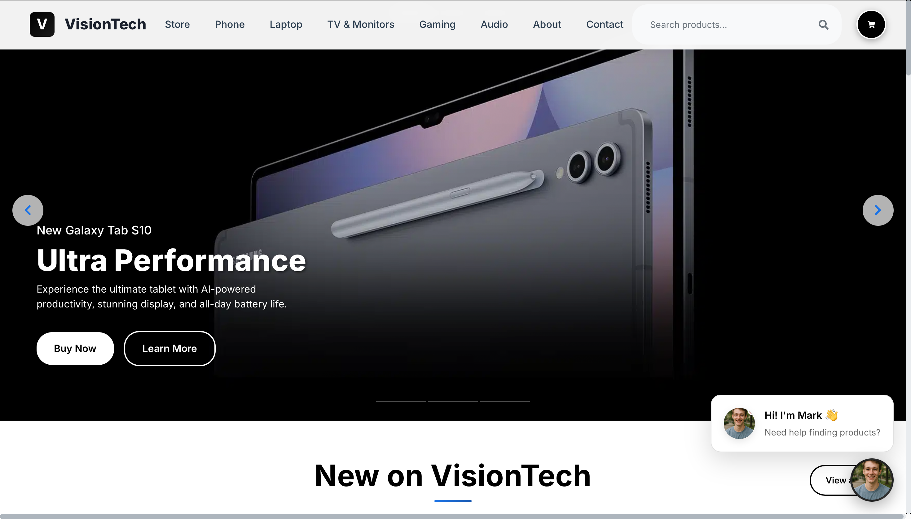
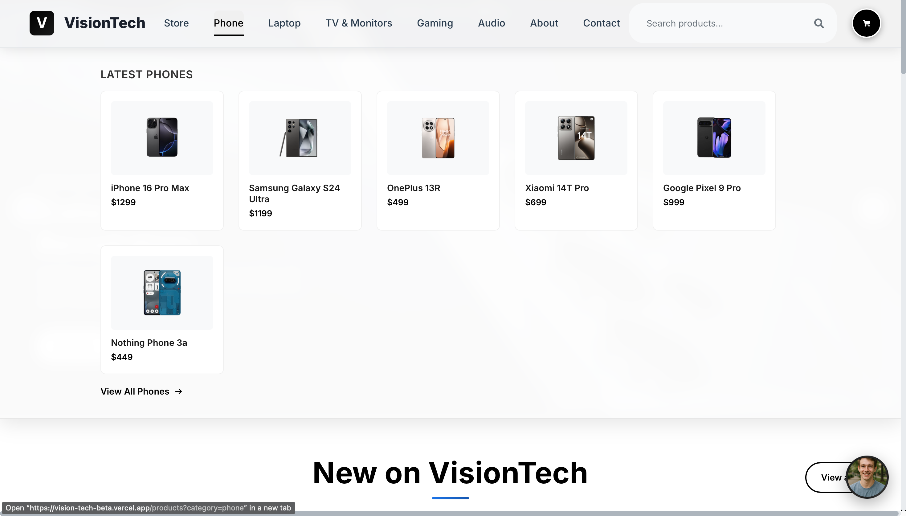
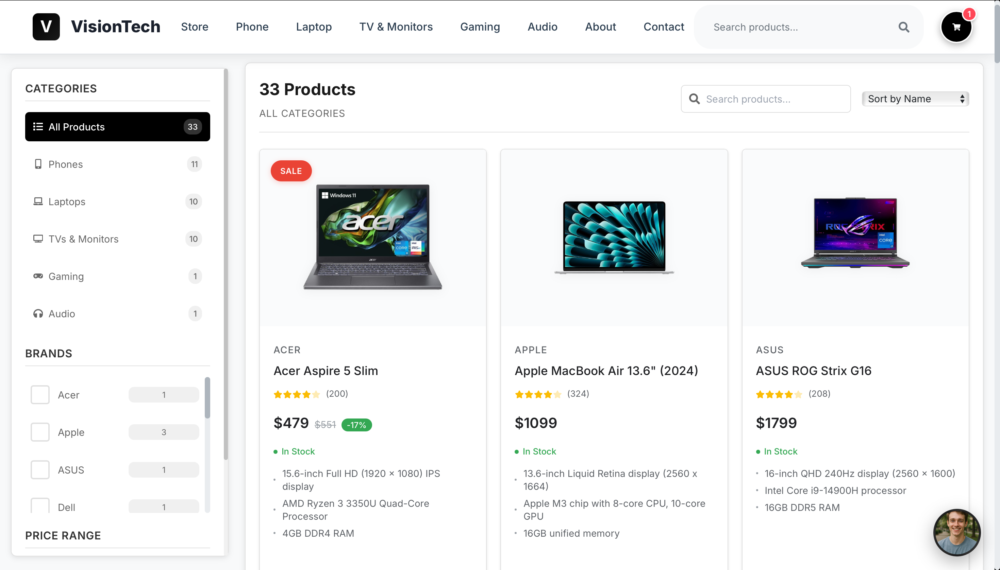
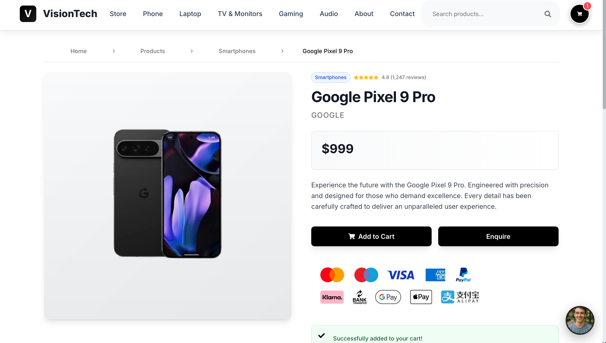
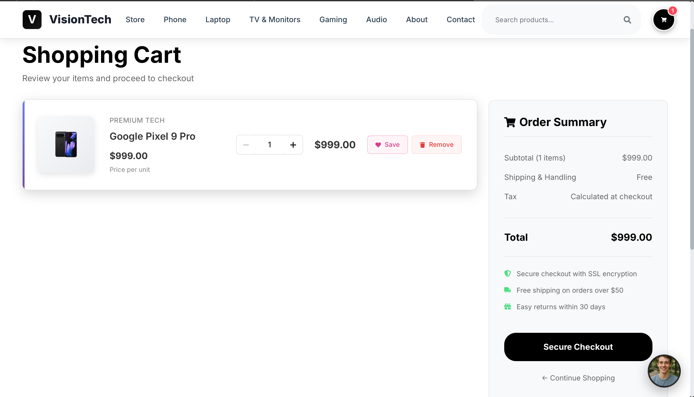
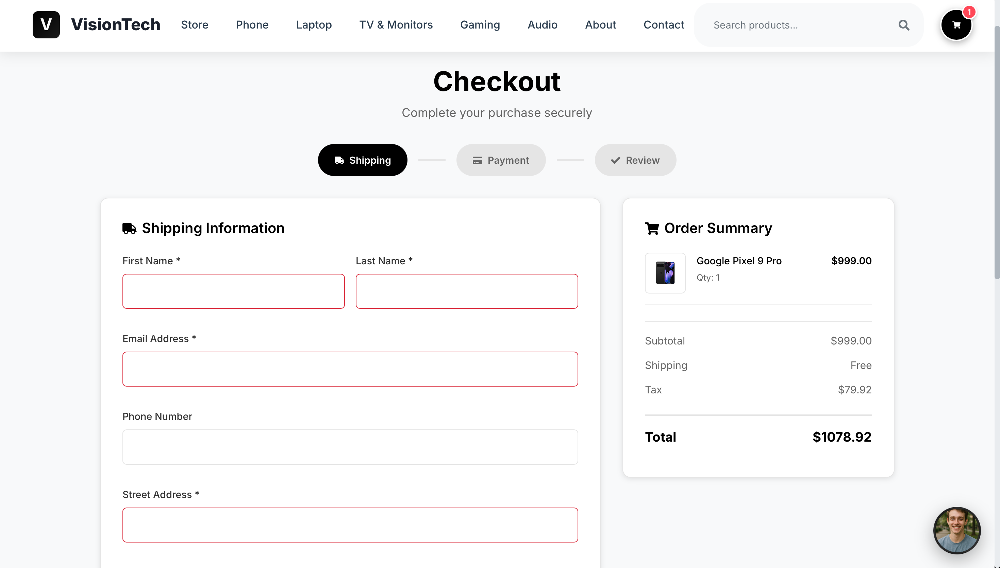

  # VisionTech: AI-Powered E-Commerce Platform

  An enhanced e-commerce platform with AI-powered chatbot integration for
  electronics and gadgets, an advanced version of my Final Year
  Project.

  # 🌐 Live Demo
  
https://vision-tech-beta.vercel.app


  ## 🚀 Features

  - **Modern E-commerce Interface** - React-based responsive frontend
  - **AI-Powered Chatbot** - Intelligent product recommendations using
  Gemini AI
  - **Product Management** - Complete CRUD operations for products
  - **User Authentication** - Secure login/registration system
  - **Shopping Cart** - Full cart functionality with checkout
  - **Category Filtering** - Easy product browsing by categories
  - **Search Functionality** - Advanced product search capabilities
  - **Responsive Design** - Mobile-first approach with Tailwind CSS

  ## 🛠️ Tech Stack

  **Frontend:**
  - React.js
  - Tailwind CSS
  - JavaScript (ES6+)

  **Backend:**
  - Python Flask
  - MongoDB
  - REST API

  **AI Integration:**
  - Google Gemini AI API
  - Natural Language Processing

  **Deployment:**
  - Vercel (Frontend)
  - Flask Server (Backend)

  ## 📋 Prerequisites

  - Python 3.8+
  - Node.js 14+
  - MongoDB
  - Google Gemini AI API Key

 ## 🚀 Installation

  1. **Clone the repository**
     ```bash
     git clone https://github.com/BhaveshNank/https://github.com/BhaveshNank/VisionTech.git
     cd VisionTech

  2. Backend Setup
  pip install -r requirements-simple.txt
  3. Frontend Setup
  cd website-ui
  npm install
  npm run build
  cd ..
  4. Environment Variables
  Create a .env file in the root directory:
  SECRET_KEY=your_flask_secret_key
  MONGODB_URI=your_mongodb_connection_string
  GEMINI_API_KEY=your_gemini_api_key
  ALLOWED_ORIGINS=http://localhost:3000,https://vision-tech-beta.vercel.app
  5. Run the Application
  python app.py

  💻 Usage

  1. Access the live demo at https://vision-tech-beta.vercel.app
  2. Browse products by categories
  3. Use the AI chatbot for product recommendations
  4. Add items to cart and proceed to checkout
  5. Register/login for personalized experience

  🤖 AI Chatbot Features

  - Product recommendations based on user queries
  - Natural language understanding
  - Context-aware responses
  - Integration with product database

  🔧 API Endpoints

  - GET /api/products - Get all products
  - POST /api/products - Add new product
  - GET /api/categories - Get product categories
  - POST /api/chat - Chatbot interaction
  - POST /api/users/register - User registration
  - POST /api/users/login - User login

  👨‍💻 Author

  Bhavesh Nankani
  - GitHub: https://github.com/BhaveshNank

## 📸 Screenshots

### Homepage & Hero Section
  
  *Modern landing page with hero banner and featured products*

  ### Navigation & Categories
  
  *Easy navigation with category-based mega menu*

  ### Product Catalog with Filters
  
  *Browse products with advanced filtering and search capabilities*

  ### Product Details & Specifications
  
  *Detailed product information with technical specifications*

  ### Add to Cart Functionality
  
  *Seamless add-to-cart experience with instant feedback*

  ### Secure Checkout Process
  
  *Complete checkout flow with shipping and payment options*
